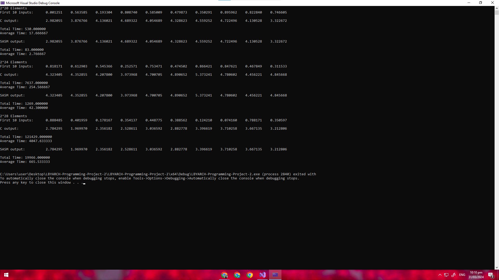

# LBYARCH Programming Project 2
## About the Project
### Description
This project aims to compare and analyze the execution time of a C function and an external function implemented in x86-64 assembly in both debug and release mode. For this purpose, a short program was created in Visual Studio 2022 to calculate the sum of every seven elements in an array, and these results are then stored in a separate array. These elements are single-precision floats that are initialized with the same random value every time the program runs.  
The program follows this format:  
### Y[i] = X[i-3] + X[i-2] + X[i-1] + X[i] + X[i+1] + X[i+2] + X[i+3]

An example can be seen below:
### Input: X-> 1, 2, 3, 4, 5, 6, 7, 8
### Output: Y-> 28, 35

### Steps Followed
1. Initialize the size and values of the array
2. Fill the cache
3. Call the function 30 times
4. Calculate the average time per call/ total time
5. Repeat steps 2-4 (for SASM)
## How to Run
1. Have a local copy of the project.
2. Change NASM location in the properies of *sliding_window.asm.* (Currently set to C:/nasm/nasm)
3. Run *main.c* with th selected configuration.
## Comparative Analysis
To measure the execution time of these functions, a clock was used to record the time before the function call and right after the function call. The difference between these times was then calculated to determine the duration of each function call. Furthermore, it was repeated three times with an array size of 220, 224, 228 for both release and debug mode.

### Debug mode 
 
In debug mode, the C function runs faster for the three array sizes than the external x86-64 function. This should be the expected result, as assembly is a low-level language and does not go through the same level of abstraction. Code written in assembly is directly mapped to machine language executable by the CPU. More of its advantages can be seen <a href="https://www.spiceworks.com/tech/tech-general/articles/what-is-assembly-language/">here</a>.
Debug | 2^20      | 2^24      | 2^28      
---|---|---|---
 C       | 17.67     | 254.57    | 4047.63   
 Sasm    | 2.77      | 42.30     | 605.53    
### Release mode
 
## Authors
Jean Cabrera  
Bentley Lu
